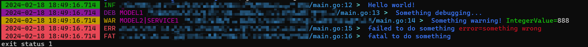

# RainbowLog
Simple, configurable,structured Logging for Go. 

RainbowLog's API is designed to provide both a great developer experience and stunning performance. 
Its unique chaining API allows rainbowlog to write JSON log events by avoiding allocations and reflection.

To keep the code base and the API simple, rainbowlog focuses on efficient structured logging only. 
Pretty logging on the console is made possible using the provided (but inefficient) `rainbowlog.ConsolePacker`.



## Installation

```shell
go get -u github.com/rambollwong/rainbowlog
```

## Getting Started

### Use global logger

#### Use global logger by default options

```go
package main

import (
	"github.com/rambollwong/rainbowlog/log"
)

func main() {
	log.UseDefault()

	log.Logger.Info().Msg("Hello world!").Done()
}

// Output: {"_TIME_":"2024-02-19 19:50:09.008","_LEVEL_":"INFO","_CALLER_":"/path/to/main.go:10","message":"Hello world!"}
```

> Note: By default log writes to `os.Stderr`

#### Use global logger by rainbow default options

```go
package main

import (
	"errors"

	"github.com/rambollwong/rainbowlog/log"
)

func main() {
	log.UseDefault()

	log.Logger.Info().Msg("Hello world!").Done()
	log.Logger.Debug().WithLabels("MODEL1").Msg("Something debugging...").Done()
	log.Logger.Warn().WithLabels("MODEL2", "SERVICE1").Msg("Something warning!").Int("IntegerValue", 888).Done()
	log.Logger.Error().Msg("failed to do something").Err(errors.New("something wrong")).Done()
	log.Logger.Fatal().Msg("fatal to do something").Done()
}
```

Output:


#### Use global logger by config file

RainbowLog supports setting logger options based on configuration files.
If you want to use a configuration file, you need to ensure that the configuration file contains Rainbow Log configuration items.
Rainbow Log supports configuration files in three formats: `.yaml`|`.json`|`.toml`. For specific configuration templates, see the corresponding files in the [`config`](./config) package.

Assume that we have prepared a configuration file `rainbowlog.yaml` and placed it in the same directory as the execution file, then:

```go
package main

import (
	"errors"

	"github.com/rambollwong/rainbowlog/log"
)

func main() {
	log.UseDefaultConfigFile()

	log.Logger.Info().Msg("Hello world!").Done()
	log.Logger.Debug().WithLabels("MODEL1").Msg("Something debugging...").Done()
	log.Logger.Warn().WithLabels("MODEL2", "SERVICE1").Msg("Something warning!").Int("IntegerValue", 888).Done()
	log.Logger.Error().Msg("failed to do something").Err(errors.New("something wrong")).Done()
	log.Logger.Fatal().Msg("fatal to do something").Done()
}
```

If you want to use a `.json` or `.toml` type configuration file, you only need to modify the `log.DefaultConfigFileName`, for example:

```go
log.DefaultConfigFileName = "rainbowlog.json"
```

Or

```go
log.DefaultConfigFileName = "rainbowlog.toml"
```

If you also want to specify the directory where the configuration file is located, you only need to modify `log.DefaultConfigFilePath`:

```go
log.DefaultConfigFilePath = "/path/of/config/files"
```

> Note: Modifying `log.DefaultConfigFileName` and `log.DefaultConfigFilePath` needs to be executed before `log.UseDefaultConfigFile()`, otherwise it will not take effect.

#### Use global logger by custom options

If you want to use custom options for Global logger, we have reserved the `log.UseCustomOptions(opts ...Option)` API for implementation. 
Supported `Option` is detailed in [`option.go`](./option.go).

### Custom logger

If you don’t want to use Global logger, you can initialize a `Logger` instance through the `New` method. 
The `New` method receives the `Option` parameters.
Supported `Option` is detailed in [`option.go`](./option.go).

```go
package main

import (
	"errors"
	"path/filepath"

	"github.com/rambollwong/rainbowlog"
)

func main() {
	DefaultConfigFileName := "rainbowlog.yaml"
	DefaultConfigFilePath := "/path/of/config/files"

	logger := rainbowlog.New(
		rainbowlog.WithDefault(),
		rainbowlog.WithConfigFile(filepath.Join(DefaultConfigFilePath, DefaultConfigFileName)),
	)

	logger.Info().Msg("Hello world!").Done()
	logger.Debug().WithLabels("MODEL1").Msg("Something debugging...").Done()
	logger.Warn().WithLabels("MODEL2", "SERVICE1").Msg("Something warning!").Int("IntegerValue", 888).Done()
	logger.Error().Msg("failed to do something").Err(errors.New("something wrong")).Done()
	logger.Fatal().Msg("fatal to do something").Done()
}
```

### SubLogger

SubLogger support allows you to create a logger instance that inherits from the parent logger and can reset some `Option` when needed.
For example, a scenario where a `LABEL` different from the parent Logger is used in a submodule.

```go
package main

import (
	"os"

	"github.com/rambollwong/rainbowlog"
	"github.com/rambollwong/rainbowlog/level"
)

func main() {
	logger := rainbowlog.New(
		rainbowlog.WithDefault(),
		rainbowlog.AppendsEncoderWriters(rainbowlog.JsonEnc, os.Stderr),
		rainbowlog.WithCallerMarshalFunc(nil),
		rainbowlog.WithLevel(level.Info),
		rainbowlog.WithLabels("ROOT"),
	)

	logger.Debug().Msg("Hello world!").Done()
	logger.Info().Msg("Hello world!").Done()

	subLogger := logger.SubLogger(
		rainbowlog.WithLevel(level.Debug),
		rainbowlog.WithLabels("SUBMODULE"),
	)

	subLogger.Debug().Msg("Hello world!").Done()
	subLogger.Info().Msg("Hello world!").Done()
}

// Output:
// {"_TIME_":"2024-02-21 11:28:02.150","_LEVEL_":"INFO","_LABEL_":"ROOT","message": "Hello world!"}
// {"_TIME_":"2024-02-21 11:28:02.150","_LEVEL_":"DEBUG","_LABEL_":"SUBMODULE","message":"Hello world!"}
// {"_TIME_":"2024-02-21 11:28:02.150","_LEVEL_":"INFO","_LABEL_":"SUBMODULE","message":"Hello world!"}

```

### Modify time output format

The default time format of RainbowLog is `2006-01-02 15:04:05.000`,
you can modify this format through `WithTimeFormat(timeFormat string)` Option,
the format can be a string that conforms to golang time formatting rules,
it can also be `UNIX` or `UNIXMS` or `UNIXMICRO` or `UNIXNANO`,
They respectively represent the return value of `Unix()` or `UnixMilli()` or `UnixMicro()` or `UnixNano()` which outputs `time.Time`.

```go
package main

import (
	"os"

	"github.com/rambollwong/rainbowlog"
)

func main() {
	logger := rainbowlog.New(
		rainbowlog.WithDefault(),
		rainbowlog.AppendsEncoderWriters(rainbowlog.JsonEnc, os.Stderr),
		rainbowlog.WithTimeFormat(rainbowlog.TimeFormatUnix),
	)

	logger.Info().Msg("Hello world!").Done()
}

// Output:{"_TIME_":1708346689,"_LEVEL_":"INFO","_CALLER_":"main.go:16","message":"Hello world!"}
```
### Hooks

```go
package main

import (
	"fmt"
	"os"

	"github.com/rambollwong/rainbowlog"
	"github.com/rambollwong/rainbowlog/level"
)

func main() {
	var hook rainbowlog.HookFunc = func(r rainbowlog.Record, level level.Level, message string) {
		fmt.Printf("hook: %s, %s\n", level.String(), message)
	}
	logger := rainbowlog.New(
		rainbowlog.WithDefault(),
		rainbowlog.AppendsEncoderWriters(rainbowlog.JsonEnc, os.Stderr),
		rainbowlog.WithCallerMarshalFunc(nil),
		rainbowlog.AppendsHooks(hook),
		rainbowlog.WithLevel(level.Info),
	)

	logger.Debug().Msg("Hello world!").Done()
	logger.Info().Msg("Hello world!").Done()
}

// Output: 
// hook: info, Hello world!
// {"_TIME_":"2024-02-21 11:42:17.592","_LEVEL_":"INFO","message":"Hello world!"}
```

### More

Of course, we also provide more features and functions, looking forward to your exploration and discovery!